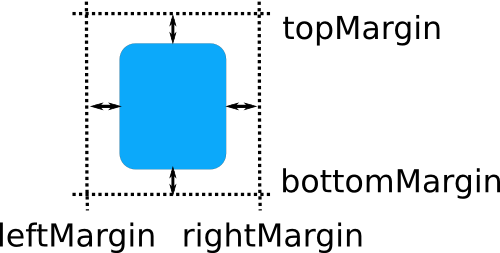

=====================
QML básico
=====================

.. sectionauthor:: `rafael rojas <https://github.com/rafael-rojas>`_

.. issues:: 4

Sintaxis de QML
---------------

QML es un lenguaje declarativo que se usa para describir la interfaz grafica de tu aplicación. QML describe el aspecto y el comportamiento de la misma. La interfaz se divide en elementos mas pequeños que se combinan con componentes.
Así pues un archivo QML no es mas que una descripción detallada de como quieres que sean los elementos que componen tu programa. Esta descripción puede enriquecerse para que proporcione una logica mas compleja utilizando el lenguaje de programación Javascript.

Consideraciones iniciales sobre QML
====================================

* Un archivo QML no es mas que una jerarquia  de elementos.
* Cada archivo QML unicamente puede tener un elemento raiz, como ocurre en los archivos HTML.
* Un elemento se define con su tipo seguido de un bloque entre llaves ``{ }``.
* Dentro de ese bloque detallamos las propiedades de ese elemento u otros elementos.
* LAs propiedades se definen en la forma ``nombre_propiedad : valor``.
* Los elementos se pueden anidar, un elemento padre puede tener elementos hijos.
* Los elementos hijos son aquellos que se definen dentro del bloque ``{ }`` del padre.
* Los elementos hijos pueden tener elementos hermanos. 
* Elementos hermanos son aquellos que comparten el mismo padre. Es decir, se encuentran anidados dentro del mismo bloque padre.

.. important::
    Es importante comprender que existen elementos padres, hijos y hermanos. Debido a como se verá mas adelante existen grupos de propiedades comunes a todos los elementos, como las propiedades ``anchors``, que se aplican con respecto a los elementos padre y hermanos de un elemento.
    
* Se puede acceder al elemento padre de un elemento con la palabra clave ``parent``.
* Los comentarios se hacen utilizando ``//`` para un unica linea y ``/* */`` para multiples lienas, igual que en C,C++ y Javascript.

Un ejemplo de archivo QML 
=========================
    
.. literalinclude:: ejemplos/rectangulo.qml
    :start-after: M1>>
    :end-before: <<M1

La sentencia ``import`` importa un modulo en una determinada versión.

En este caso y de forma general cuando se desean utilizar los elementos proporcionados por defecto por Qt para realizar interfaces graficas de usuario (GUIs), importamos el modulo QtQuick 2.0 como juego inicial de elementos.

Esto nos permite definir root como un elemento de tipo Rectangle, el tipo Rectangle es un elemento definido en el modulo QtQuick. Sin importar dicho modulo, el tipo Rectangle será desconocido para nuestro programa.

;

definir elementos propios

que pasa si no importas QtQuick

Los elementos hijos heredan el sistema de coordenadas del padre, las coordenadas x e y son siempre relativas al padre

Propiedades comunes de elementos QML
-------------------------------------

``id`` se suele usar para asignar un identificador a un elemento y poder referenciarlo.

Propiedades de geometria
========================

* ``x`` es la posicion x del elemento.
* ``y`` es la posicion y del elemento.
* ``z`` es la posicion z del elemento.
* ``width`` es el ancho del elemento.
* ``height`` es el alto del elemento.

Propiedades de gestión de Layout
================================

* ``anchors`` son propiedades que nos permiten posicionar un elemento especificando su relación con otros elementos. Cada elemento tiene el siguiente conjunto de siete lineas de "posición relativa":

.. warning::

        Solo puedes posicionar elementos relativamente usando anchors con sus elementos padres o hermanos.

* ``anchors.right`` es el margen derecho.
* ``anchors.left`` es el margen izquierdo.
* ``anchors.top`` es el margen superior.
* ``anchors.bottom`` es el margen inferior.

.. note::
        Los margenes no se aplican si el elemento no usa anchors.

* ``anchors.horizontalCenter`` fija el centro horizontal.
* ``anchors.verticalCenter`` fija el centro vertical.
* ``anchors.baseline`` baseline es la linea imaginaria donde se situa el texto.

.. note::
        En los elementos que no tienen texto, actua igual que la propiedad top.

Además existen las siguientes propiedades que completan el grupo de propiedades de anchor:

.. note::
        Los offsets nos permiten poder manipular la posición usando las lineas centrales del anchor.

* ``anchors.horizontalCenterOffset``
* ``anchors.verticalCenterOffset``
* ``anchors.baselineOffset``
* ``anchors.alignWhenCentered``
* ``anchors.fill`` se usa para conseguir que un elemento tenga la misma geometria que otro elemento.

    .. warning::
            Esta propiedad no sobreescribe el valor de un margen que ya este definido previamente. Para ello hay que "limpiar" el valor de ese margen poniendo undefined.

    .. note::
            Los margenes no se aplican si el elemento no usa anchors.

* ``anchors.centerIn`` sirve para fijar los valores de anchors.verticalCenter y anchors.horizontalCenter del elemento a los mismos valores de esas propiedades de otro elemento.

Los margenes especifican la cantidad de espacio vacio que se deja fuera de los anchors del elemento.

(licencia de la imagen: GNU Free Documentation License version 1.3)

Existen las siguientes propiedades:

* ``anchors.topMargin`` valor del margen superior fuera del anchor.
* ``anchors.bottomMargin`` valor del margen inferior fuera del anchor.
* ``anchors.leftMargin`` valor del margen izquierdo fuera del anchor.
* ``anchors.rightMargin`` valor del margen derecho fuera del anchor.
* ``anchors.margins`` especifica el mismo valor de margen para las cuatro esquinas. Con esta propiedad fijas el valor de los margenes superior, inferior, izquierdo y derecho al mismo valor.

Key handling
============

attached Key and KeyNavigation properties to control key handling and the input focus property to enable key handling in the first place

Transformation
==============

scale and rotate transformation and the generic transform property list for x,y,z transformation and their transformOrigin point

Visual
======
opacity to control transparency, visible to show/hide elements, clip to restrain paint operations to the element boundary and smooth to enhance the rendering quality

    * antialiasing se usa para decidir si el elemento usa antialiasing o no.

    .. note ::
            El antialiasing elimina el efecto estético desagradable de líneas escalonadas que aparecen en un gráfico o texto con aliasing.

State definition 	
states list property with the supported list of states and the current state property as also the transitions list property to animate state changes.

.. note::

    los tipos basicos que vienen con import Qtquick 2
    http://doc.qt.io/qt-5/qmlbasictypes.html
    http://doc.qt.io/qt-5/qtquick-positioning-anchors.html#anchor-margins-and-offsets
    http://doc.qt.io/qt-5/qml-qtquick-item.html#anchors.baseline-prop

    sigo el apartado de http://qmlbook.github.io/en/ch04/index.html#basic-elements

ELEMENTOS BASICOS
-----------------

ELEMENTOS VISUALES
------------------

Texto
=====

Se usa para mostrar un texto

.. note::

    Puedes usar el grupo de propiedades de fuente para modificar la fuente
    
    
* elide
* Wrapmode
* style
* styleColor

.. warning::
    El texto no tiene fondo

propiedades
	text en esta propiedad escribes el texto a mostrar

	
Rectangulo
==========

http://doc.qt.io/qt-5/qml-qtquick-rectangle.html

propiedades

    * antialiasing : se usa para que los bordes redondeados se vean bien
    * border.width : ancho del borde
    * border.color : color del borde
    * color : color de relleno, el color por defecto es el blanco
    * gradient : rellenar usando un gradiente
    * radius : hacer los bordes redondeados

.. warning::
  Si defines la propiedad color y la propiedad gradiente, se usará el gradiente.

.. note::
  Si defines un color de borde y no quieres que el rectangulo tenga relleno puedes poner color a transparent

ejemplo (sacado de la web)

.. code-block:: qml

    import QtQuick 2.0

    Rectangle {
	width: 100
	height: 100
	color: "red"
	border.color: "black"
	border.width: 5
	radius: 10
    }

