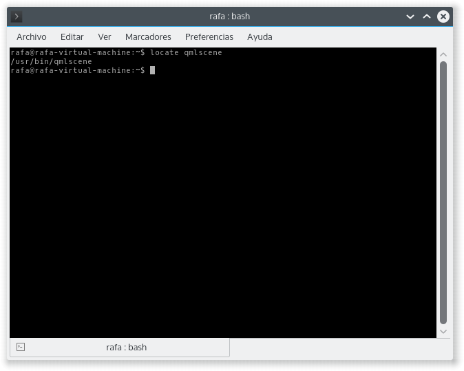
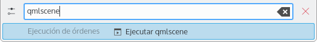
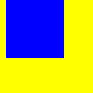
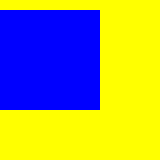
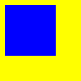

=====================
QML básico
=====================

.. sectionauthor:: `rafael rojas <https://github.com/rafael-rojas>`_

.. issues:: 4

¿Qué es QML?
------------

QML es un lenguaje declarativo que se usa para describir la interfaz grafica de tu aplicación. 

QML describe el aspecto y el comportamiento de la misma. La interfaz se divide en elementos mas pequeños que se combinan con componentes.

Así pues un archivo QML no es mas que una descripción detallada de como quieres que sean los elementos que componen tu programa. Esta descripción puede enriquecerse para que proporcione una logica mas compleja utilizando el lenguaje de programación Javascript.

Archivos .qml 
-------------

Guardamos nuestra interfaz en la forma de archivos de texto con extensión .qml.

Visualizar rapidamente tu interfaz QML
--------------------------------------

A la hora de diseñar la interfaz grafica de tu aplicacion o programa, Qt proporciona una herramienta para previsualizar el aspecto de tus archivos QML que es muy util a la hora de diseñar.

Esta herramienta es ``qmlscene``.

En Kubuntu puedes acceder a esta herramienta buscandola con

.. code-block:: shell

  $ locate qmlscene
  
y te devolvera la ubicación de la herramienta

.. code-block:: shell

    /usr/bin/qmlscene
  

  
Aunque normalmente con escribir ``qmlscene`` en tu terminal ya podrás utilizarla.

Tambiene puedes usar las teclas ``Alt`` + ``F2`` y escribir ``qmlscene``, inmediatamente te saldra la opcion "Ejecutar qmlscene" pinchas sobre ella y ya podras ver el selector donde escoger tu archivo .qml a visualizar.

Esta herramienta es un poco engorrosa de usar porque no recuerda el ultimo directorio que has utilizado y cada vez debes volver a ir a la carpeta donde tienes tus archivos QML. Es por esto que se recomienda usarla desde el directorio donde tengas los archivos qml a visualizar

imagen

Un ejemplo de archivo QML 
-------------------------

Veamos un ejemplo sencillo de archivo QML:

.. literalinclude:: ejemplos/cuadrado.qml
    :caption: Ejemplo:
    :name: cuadrado
    :lines: 2,4,5,9,10
    
Y se veria así en qmlscene:

.. image:: img/cuadrado.png

Sintaxis y estructura de archivos QML
-------------------------------------

Visto el ejemplo, vamos a ver cual es la sintaxis que se usa en los archivos QML.

* Un archivo QML no es mas que una jerarquia  de elementos.
* Cada archivo QML unicamente puede tener un elemento raiz, como ocurre en los archivos HTML.
* Un elemento se define con su tipo seguido de un bloque entre llaves ``{ }``.
* Los elementos se especifican por su tipo, el nombre de su tipo siempre empieza escribiendose con una letra mayuscula.
* Dentro de ese bloque detallamos las propiedades de ese elemento o añadimos otros elementos.
* Las propiedades se definen en la forma ``nombre_propiedad : valor`` el nombre de la propiedad seguido de dos puntos y su valor.
* Los elementos se pueden anidar, un elemento padre puede tener elementos hijos.
* Los elementos hijos son aquellos que se definen dentro del bloque ``{ }`` del padre.
* Los elementos hijos pueden tener elementos hermanos. 
* Elementos hermanos son aquellos que comparten el mismo padre. Es decir, se encuentran anidados dentro del mismo bloque padre.

.. important::
    Es importante comprender que existen elementos padres, hijos y hermanos. Debido a como se verá mas adelante existen grupos de propiedades comunes a todos los elementos, como las propiedades ``anchors``, que se aplican con respecto a los elementos padre y hermanos de un elemento.
    
* Se puede acceder al elemento padre de un elemento con la palabra clave ``parent``.
* Los comentarios se hacen utilizando ``//`` para una unica linea y ``/* */`` para multiples lineas, igual que en C,C++ y Javascript.

Un ejemplo mas elaborado de archivo QML 
=======================================

Veamos un ejemplo un poco mas complejo. En este caso tenemos un elemento de tipo rectangulo llamado root con unas propiedades de ancho, alto y color que es padre de un elemento de tipo imagen llamado rocket.
    
.. literalinclude:: ejemplos/rectangulo.qml
    :start-after: M1>>
    :end-before: <<M1

Al inicio del archivo tenemos la sentencia ``import`` que se encarga de importar un modulo en una determinada versión.

En este caso y de forma general cuando se desean utilizar los elementos proporcionados por defecto por Qt para realizar interfaces graficas de usuario (GUIs), importamos el modulo QtQuick en su versión 2.0 para poder utilizar sus elementos predefinidos.

Esto nos permite definir al elemento llamado root como un elemento de tipo Rectangle, el tipo Rectangle es un elemento definido en el modulo QtQuick. Sin importar dicho modulo, el tipo Rectangle será desconocido para nuestro programa.

.. note:: 

    ¿Qué ocurre si no importas el modulo QtQuick? 
    
    * Si usas elementos de Qtquick
    * Si no usas elementos de Qtquick

Propiedades
===========

Como hemos visto las propiedades se definen con un par <nombre>: <valor>. 

Las propiedades se pueden especificar una por linea en cuyo caso no añadimos ningún caracter al final de la linea. 

.. code-block:: qml
    :caption: Una linea, una propiedad
    :name: linea-unica
    
    color: "#D8D8D8"

O se pueden escribir varias propiedades en una misma linea como ocurre en el ejemplo anterior:

.. code-block:: qml
    :caption: Una linea, dos propiedades
    :name: linea-multiple

    width: 120; height: 240

En este caso debemos separar cada propiedad con un ";".

.. important::

  Las propiedades tienen definido un tipo de datos para sus valores y solo aceptan valores que sean de ese mismo tipo de datos.
  
  Por ejemplo si una propiedad ha sido definida como que acepta numeros enteros los valores que se asignen a esa propiedad deberan ser de tipo entero.
  
  Si a una propiedad que espera valores de tipo real le asignas un valor de tipo cadena obtendras un error:
  property int longitud: "verde" //error

Tipos de valores de las propiedades
===================================

http://developer.ubuntu.com/api/qml/sdk-1.0/QtQml.qtqml-syntax-objectattributes/#valid-property-values

Existen dos tipos de valores que pueden asiganrse a una propiedad, valores estaticos y expresiones.

Valores estaticos
=================

Son valores cuyo tipo coincide (o debe poderse convertir) con el tipo de valor que se le puede asignar a la propiedad.

http://developer.ubuntu.com/api/qml/sdk-1.0/QtQml.qtqml-typesystem-basictypes/

Los valores aceptan los siguientes tipos de datos basicos:

+---------------+---------------------------------------------------------------+
| tipo		|								|
+===============+===============================================================+
| int 		| numeros enteros						|
+---------------+---------------------------------------------------------------+
| bool		| true o false							|
+---------------+---------------------------------------------------------------+
| real		| numeros con un punto decimal					|
+---------------+---------------------------------------------------------------+
| double	| numeros con un punto decimal guardado con doble precisión	|
+---------------+---------------------------------------------------------------+
| string	| cadena, una cadena de texto					|
+---------------+---------------------------------------------------------------+
| url		| localizador de recursos**					|
+---------------+---------------------------------------------------------------+
| list		| lista, una lista de elementos QML 				|
+---------------+---------------------------------------------------------------+
| var 		| una variable, normalmente un tipo de propiedad generico**	|
+---------------+---------------------------------------------------------------+
| enumeration	| una enumeracion de nombres					|
+---------------+---------------------------------------------------------------+

.. warning::

  Los valores de tipo cadena deben ir entrecomillados con comillas dobles o con comillas simples.
  
Ademas de los tipos de datos basicos de QML, los modulos de QML proporcionan otros tipos de datos mas complejos:

+---------------+-----------------------------------------------------------------------+
| tipo		|									|
+===============+=======================================================================+
| date 		| tipo fecha								|
+---------------+-----------------------------------------------------------------------+
| time		| tipo hora								|
+---------------+-----------------------------------------------------------------------+
| point		| tipo punto, un valor con coordenadas x e y como atributos		|
+---------------+-----------------------------------------------------------------------+
| size		| tipo tamaño, un valor con ancho e alto como atributos (width, height)	|
+---------------+-----------------------------------------------------------------------+
| rect		| un valor con atributos x,y,width y height**				|
+---------------+-----------------------------------------------------------------------+

.. note::

  Para poder usar estos tipos de datos debes importar los modulos correspondientes que los proporcionan.
  
probar

Expresiones
===========

http://doc.qt.io/qt-4.8/qmlsyntax.html
guia JavaScript https://developer.mozilla.org/en/JavaScript/Guide

A las propiedades ademas de asignar valores, podemos asignar expresiones escritas en JavaScript:

.. code-block:: qml

    Rotación {
      //expresión con un producto
      angulo: 360 * 3
    } 

El resultado de las expresiones debe coincidir con el tipo de dato esperado por la propiedad (o debe poderse convertir).

Estas expresiones pueden incluir referencias a otros elementos y propiedades, en cuyo caso se establece un enlace. Si el valor de la expresión cambia, la propiedad que ha sido enlazada cambia tambien su valor.

.. note::
        Para hacer referencia a un elemento concreto se usa el valor de su propiedad ``id``, que tiene que estar definida.

Propiedades comunes de elementos QML
-------------------------------------

Vamos a ver las propiedades que son comunes a todos los tipos de elementos de QML. 

Es decir, puedes usar estas propiedades en todos los elementos de QML.

Propiedad identificador
=======================

* ``id`` se usa para asignar un identificador a un elemento y poder referenciarlo.

.. important::

    Un ``id`` debe usarse unicamente para referenciar elementos dentro de un mismo archivo. Si quieres hacer referencia a elementos externos es mejor usar otros mecanismos, como definir propiedades en el elemento raiz de tu archivo QML.
    
    De lo contrario y debido al mecanismo dinamyc-scoping que proporciona QML puedes acabar referenciando elementos equivocados.

.. literalinclude:: ejemplos/cuadrado.qml
    :caption: Ejemplo:
    :name: cuadrado
    :lines: 2,4,5,10

Propiedades de geometria
========================

* ``width`` es el ancho del elemento.
* ``height`` es el alto del elemento.

Propiedades de situación
========================

* ``x`` es la posicion sobre el eje horizontal empezando desde la esquina superior izquierda del elemento.

.. note::

    En los ejemplos fijate unicamente en las propiedades comunes a todos los elementos, los elementos que aparecen en los ejemplos de tipo Rectangle u otros tipos y sus propiedades especificas los veremos en profundidad mas adelante.

.. literalinclude:: ejemplos/cuadrado_x.qml

* ``y`` es la posicion sobre el eje vertical empezando desde la esquina superior izquierda del elemento.

.. literalinclude:: ejemplos/cuadrado_y.qml

Ambas propiedades combinadas:

.. literalinclude:: ejemplos/cuadrado_xy.qml

.. important::

  Los elementos hijos heredan el sistema de coordenadas del padre, las coordenadas x e y son siempre relativas al padre.

* ``z`` segun este valor un elemento se dibujará por encima o por debajo de otros elementos.

Propiedades de gestión de Layout
================================

* ``anchors`` son propiedades que nos permiten posicionar un elemento especificando su relación con otros elementos. Cada elemento tiene el siguiente conjunto de siete lineas de "posición relativa":

.. warning::

        Solo puedes posicionar elementos relativamente usando anchors con sus elementos padres o hermanos.

* ``anchors.right`` es el margen derecho.
* ``anchors.left`` es el margen izquierdo.
* ``anchors.top`` es el margen superior.
* ``anchors.bottom`` es el margen inferior.

.. note::
        Los margenes no se aplican si el elemento no usa anchors.

* ``anchors.horizontalCenter`` fija el centro horizontal.
* ``anchors.verticalCenter`` fija el centro vertical.
* ``anchors.baseline`` baseline es la linea imaginaria donde se situa el texto.

.. note::
        En los elementos que no tienen texto, actua igual que la propiedad top.

Además existen las siguientes propiedades que completan el grupo de propiedades de anchor:

.. note::
        Los offsets nos permiten poder manipular la posición usando las lineas centrales del anchor.

* ``anchors.horizontalCenterOffset``
* ``anchors.verticalCenterOffset``
* ``anchors.baselineOffset``
* ``anchors.alignWhenCentered``
* ``anchors.fill`` se usa para conseguir que un elemento tenga la misma geometria que otro elemento.

    .. warning::
            Esta propiedad no sobreescribe el valor de un margen que ya este definido previamente. Para ello hay que "limpiar" el valor de ese margen poniendo undefined.

    .. note::
            Los margenes no se aplican si el elemento no usa anchors.

* ``anchors.centerIn`` sirve para fijar los valores de anchors.verticalCenter y anchors.horizontalCenter del elemento a los mismos valores de esas propiedades de otro elemento.

Los margenes especifican la cantidad de espacio vacio que se deja fuera de los anchors del elemento.

.. image:: img/margins_qml.png

(licencia de la imagen: GNU Free Documentation License version 1.3)

Existen las siguientes propiedades:

* ``anchors.topMargin`` valor del margen superior fuera del anchor.
* ``anchors.bottomMargin`` valor del margen inferior fuera del anchor.
* ``anchors.leftMargin`` valor del margen izquierdo fuera del anchor.
* ``anchors.rightMargin`` valor del margen derecho fuera del anchor.
* ``anchors.margins`` especifica el mismo valor de margen para las cuatro esquinas. Con esta propiedad fijas el valor de los margenes superior, inferior, izquierdo y derecho al mismo valor.

Key handling
============

* ``Key`` 
* ``KeyNavigation`` properties to control key handling and 
* ``focus`` property to enable key handling in the first place

Transformación
==============

* ``scale`` 
* ``rotate`` 
* ``transform`` property list for x,y,z transformation 
* ``transformOrigin`` punto de

Visual
======

* ``opacity`` para controlar el nivel de transparencia. 
* ``visible`` para mostrar/ocultar elementos. 
* ``clip`` para restringir operaciones de dibujo al elemento frontera. 
* ``smooth`` para mejorar la calidad de renderizado.

* ``antialiasing`` se usa para decidir si el elemento usa antialiasing o no.

    .. note ::
            El antialiasing elimina el efecto estético desagradable de líneas escalonadas que aparecen en un gráfico o texto con aliasing.

Definición de estado
====================

* ``states`` list property with the supported list of states and the current 
* ``state`` property as also the 
* ``transitions`` list property to animate state changes.

.. note::

    los tipos basicos que vienen con import Qtquick 2
    http://doc.qt.io/qt-5/qmlbasictypes.html
    http://doc.qt.io/qt-5/qtquick-positioning-anchors.html#anchor-margins-and-offsets
    http://doc.qt.io/qt-5/qml-qtquick-item.html#anchors.baseline-prop

    sigo el apartado de http://qmlbook.github.io/en/ch04/index.html#basic-elements

Definir tipos de elementos propios
----------------------------------
Puedes definir tus propios tipos de elementos, añadiendole una o varias de las anteriores propiedades comunes a todos los elementos. Nuevas propiedades con valores o expresiones, o incluso añadirle nuevos elementos o elementos ya existentes.

ELEMENTOS BASICOS
-----------------

ELEMENTOS VISUALES
------------------

Texto
=====

Se usa para mostrar un texto

.. note::

    Puedes usar el grupo de propiedades de fuente para modificar la fuente
    
    
* elide
* Wrapmode
* style
* styleColor

.. warning::
    El texto no tiene fondo

propiedades
	text en esta propiedad escribes el texto a mostrar

	
Rectangulo
==========

http://doc.qt.io/qt-5/qml-qtquick-rectangle.html

propiedades

    * antialiasing : se usa para que los bordes redondeados se vean bien
    * border.width : ancho del borde
    * border.color : color del borde
    * color : color de relleno, el color por defecto es el blanco
    * gradient : rellenar usando un gradiente
    * radius : hacer los bordes redondeados

.. warning::
  Si defines la propiedad color y la propiedad gradiente, se usará el gradiente.

.. note::
  Si defines un color de borde y no quieres que el rectangulo tenga relleno puedes poner color a transparent

ejemplo (sacado de la web)

.. code-block:: qml

    import QtQuick 2.0

    Rectangle {
	width: 100
	height: 100
	color: "red"
	border.color: "black"
	border.width: 5
	radius: 10
    }

